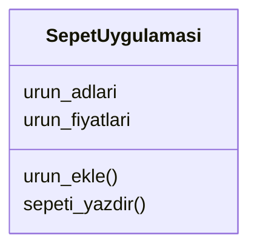
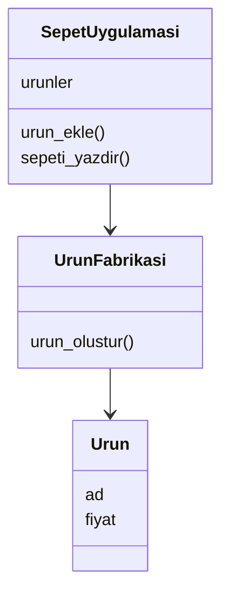

# Faz 1 önce sonra

## Önce

```mermaid
classDiagram
    class SepetUygulamasi {
        urun_adlari
        urun_fiyatlari
        urun_ekle()
        sepeti_yazdir()
    }
```

## Sonra

```mermaid
classDiagram
    class Urun {
        ad
        fiyat
    }

    class UrunFabrikasi {
        urun_olustur()
    }

    class SepetUygulamasi {
        urunler
        urun_ekle()
        sepeti_yazdir()
    }

    SepetUygulamasi --> UrunFabrikasi
    UrunFabrikasi --> Urun
```
