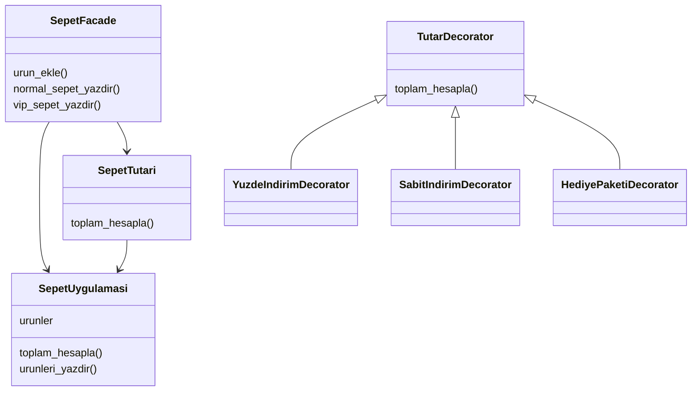

# Faz 2 yapı diyagramı

```mermaid
classDiagram
    class SepetFacade {
        urun_ekle()
        normal_sepet_yazdir()
        vip_sepet_yazdir()
    }

    class SepetUygulamasi {
        urunler
        toplam_hesapla()
        urunleri_yazdir()
    }

    class SepetTutari {
        toplam_hesapla()
    }

    class TutarDecorator {
        toplam_hesapla()
    }

    class YuzdeIndirimDecorator
    class SabitIndirimDecorator
    class HediyePaketiDecorator

    SepetFacade --> SepetUygulamasi
    SepetFacade --> SepetTutari
    SepetTutari --> SepetUygulamasi
    TutarDecorator <|-- YuzdeIndirimDecorator
    TutarDecorator <|-- SabitIndirimDecorator
    TutarDecorator <|-- HediyePaketiDecorator
```
